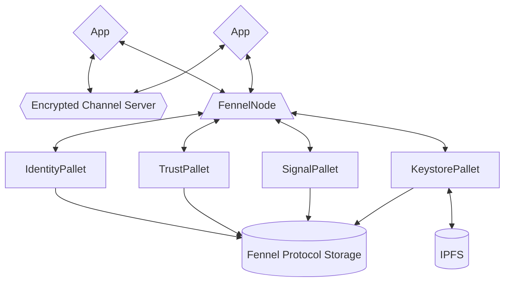

```mermaid
flowchart TD
	id2{App} <--> id1{{Encrypted Channel Server}}
	id3{App} <--> id1
	id2 <--> A[/FennelNode\]
	id3 <--> A[/FennelNode\]
	A[/FennelNode\] <--> IdentityPallet & TrustPallet & SignalPallet & KeystorePallet
	KeystorePallet <--> id4[(IPFS)]
	
	IdentityPallet --> id6[(Fennel Protocol Storage)]
	TrustPallet --> id6
	SignalPallet --> id6
	KeystorePallet --> id6
```

