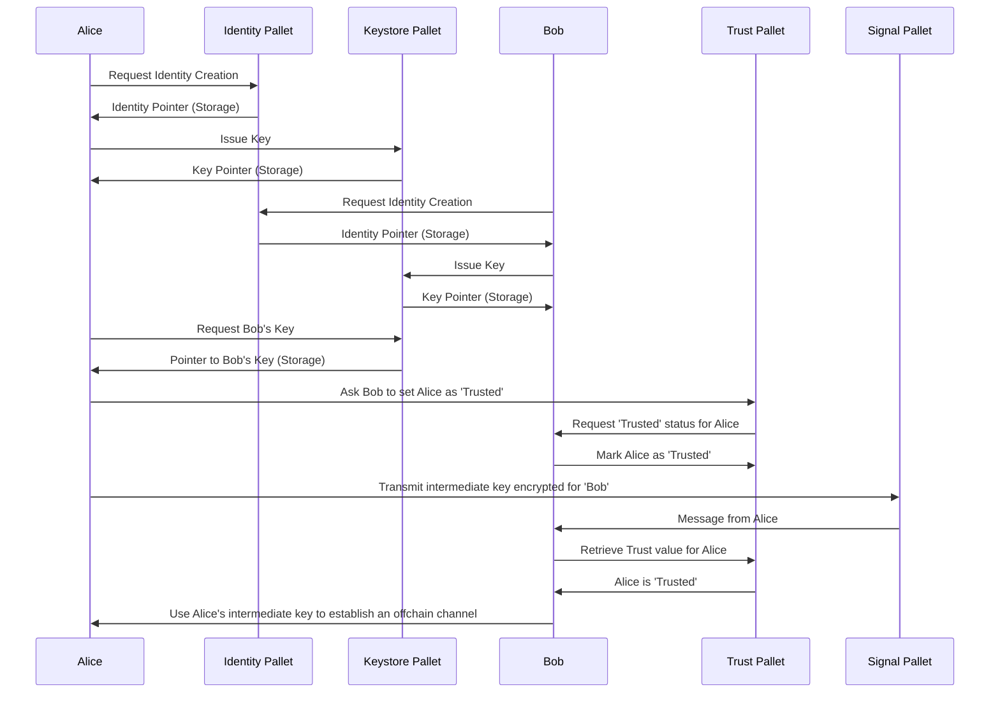

```mermaid
sequenceDiagram
	Alice->>Identity Pallet: Request Identity Creation
	Identity Pallet->>Alice: Identity Pointer (Storage)
	Alice->>Keystore Pallet: Issue Key
	Keystore Pallet->>Alice: Key Pointer (Storage)
	Bob->>Identity Pallet: Request Identity Creation
	Identity Pallet->>Bob: Identity Pointer (Storage)
	Bob->>Keystore Pallet: Issue Key
	Keystore Pallet->>Bob: Key Pointer (Storage)
	Alice->>Keystore Pallet: Request Bob's Key
	Keystore Pallet->>Alice: Pointer to Bob's Key (Storage)
	Alice->>Trust Pallet: Ask Bob to set Alice as 'Trusted'
	Trust Pallet->>Bob: Request 'Trusted' status for Alice
	Bob->>Trust Pallet: Mark Alice as 'Trusted'
	Alice->>Signal Pallet: Transmit intermediate key encrypted for 'Bob'
	Signal Pallet->>Bob: Message from Alice
	Bob->>Trust Pallet: Retrieve Trust value for Alice
	Trust Pallet->>Bob: Alice is 'Trusted'
	Bob->>Alice: Use Alice's intermediate key to establish an offchain channel
```

